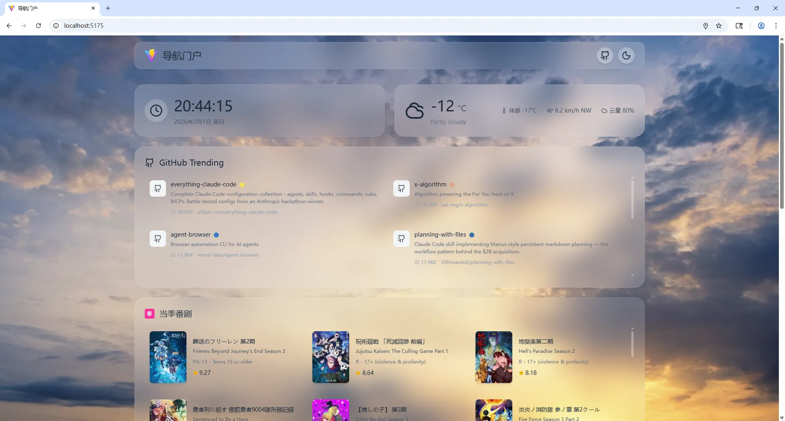

# Gacfox Portal

一个轻量级的纯前端导航门户主页，使用Vite / React / Tailwind CSS构建。支持YAML配置文件自定义站点信息、小组件和书签导航。



## 特性

- 🎨 支持明亮和暗色主题切换
- 📱 完全响应式布局，支持 PC/平板/移动端
- ⚙️ 基于 YAML 配置的纯静态页面
- 📚 分类书签导航，支持自定义图标
- 🧩 可配置的小组件系统（时钟、天气、GitHub Trending、当季番剧、Steam愿望单）
- 🚀 纯前端实现，无需后端服务

## 项目结构

```
gacfox-portal/
├── public/
│   ├── config/
│   │   └── site.yaml              # 站点配置文件，部署后主要修改这个文件
│   └── resources/                 # 图片资源文件夹，不一定非叫`resources`，里面的目录结构也可以自由指定，下面仅供参考
│       ├── background/
│       └── bookmarks/
├── src                            # 站点代码
├── index.html                     # 入口HTML文件
├── vite.config.js                 # vite配置文件
└── README.md
```

## 配置说明

所有配置都在`public/config/site.yaml`文件中。

### 站点配置

```yaml
site:
  title: "导航门户"                            # 站点标题
  icon: "/resources/bookmarks/site-icon.jpg"  # 站点ICON
  background:
    light: "/resources/background/light.jpg"  # 明亮主题背景
    dark: "/resources/background/dark.jpg"    # 暗色主题背景
```

### 小组件配置

小组件通过`widgets`数组配置，每个小组件包含`name`和可选属性。

```yaml
widgets:
  - name: time                   # 时钟组件
    gridWidth: half              # 占据的栅格宽度，full或half
  - name: weather                # 天气组件，使用Open Meteo API
    gridWidth: half              # 占据的栅格宽度，full或half
  - name: github-trending        # GitHub Trending组件，使用Github API
  - name: seasonal-anime         # 当季番剧组件，使用Jikan API
  - name: steam-wishlist         # Steam愿望单，使用CheapShark API
    ids:                         # 监测的游戏ID列表，ID用这个接口搜索：https://www.cheapshark.com/api/1.0/games?title=batman
      - 128
      - 129
      - 130
```

* 如果想删除一个小组件，将配置项移除即可，配置的顺序就是小组件在栅格中排列的顺序。
* 调用天气、Github等公共API时都有数小时的缓存，如果想立即刷新可以手动删除浏览器Local Storage中的缓存数据。
* 天气组件由于用到Geolocation API，因此必须由用户授权读取经纬度信息并使用HTTPS部署站点，否则无法通过浏览器的安全校验。

### 书签配置

```yaml
bookmarks:
  - category: "分类名称"
    items:
      - name: "书签名称"
        url: "https://example.com"
        icon: "/resources/bookmarks/icon.svg"  # 可选图标路径，相对于public目录
        description: "描述文字"                 # 可选描述文字
```

## 部署站点

先克隆项目，然后复制`site.example.yaml`到`site.yaml`并根据需求修改即可，最后安装依赖并构建项目。

```bash
npm install && npm run build
```

构建产物输出到`dist`目录，将Nginx指向目录中的静态资源即可，注意如果修改了配置文件，需要重新构建，否则`public`文件夹中的相关资源不会复制到`dist`。

参考Nginx配置文件如下。

```nginx
server {
    listen 80;
    listen [::]:80;
    listen 443 ssl;
    listen [::]:443 ssl;
    server_name portal.local.gacfox.com;
    ssl_certificate /etc/letsencrypt/live/portal.local.gacfox.com/fullchain.pem;
    ssl_certificate_key /etc/letsencrypt/live/portal.local.gacfox.com/privkey.pem;
    location / {
        root /home/pi/portal.local.gacfox.com/dist;
        index index.html index.htm;
        try_files $uri $uri/ /index.html;

        auth_basic "Restricted Content";
        auth_basic_user_file /etc/nginx/.htpasswd;
    }
}
```
